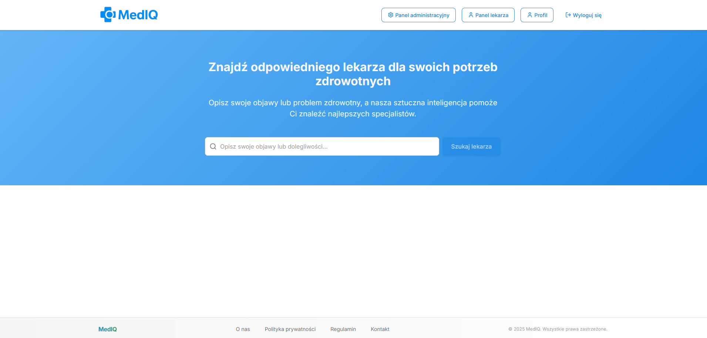
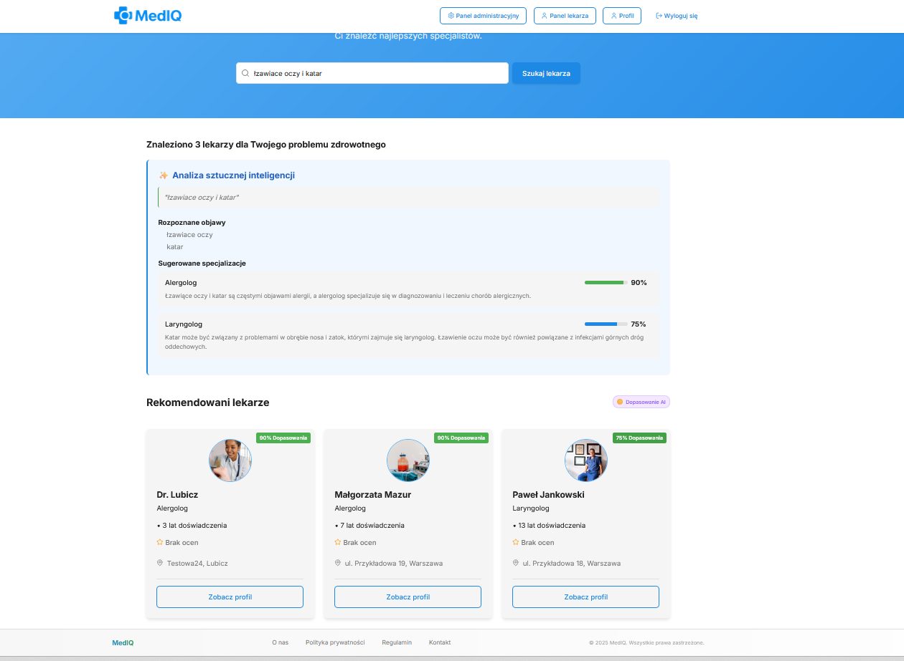
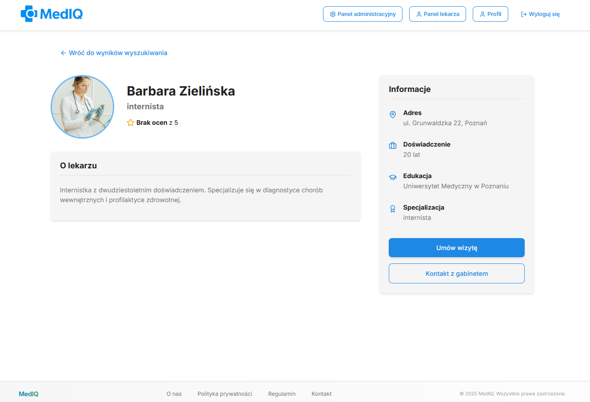
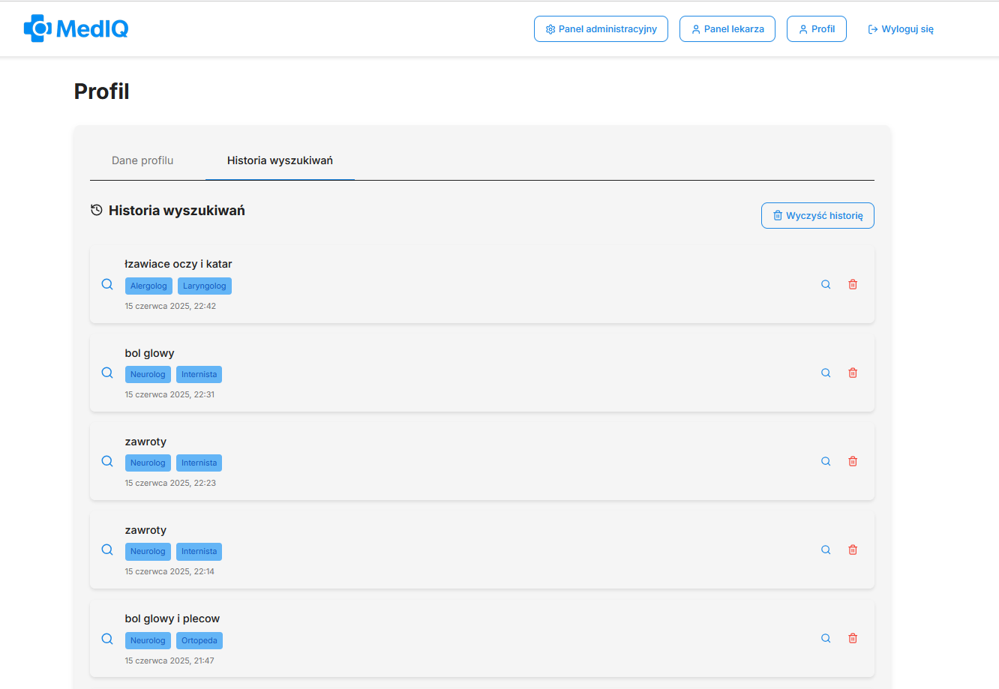
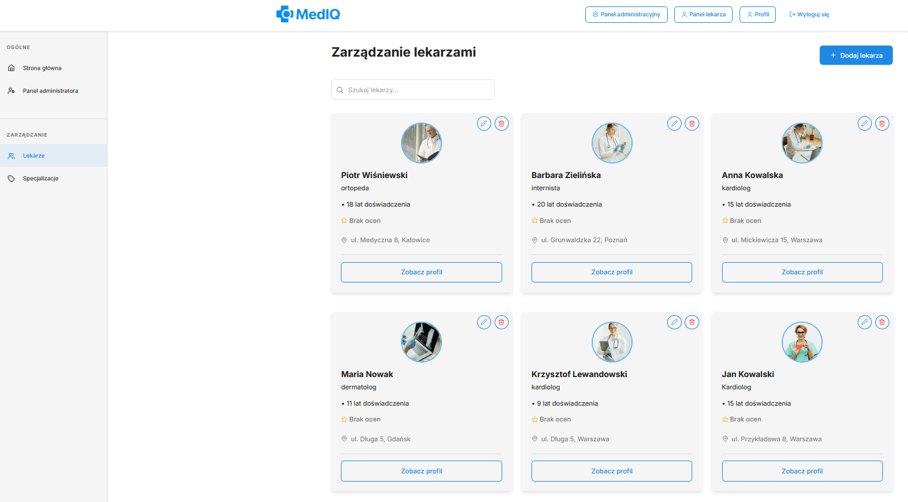
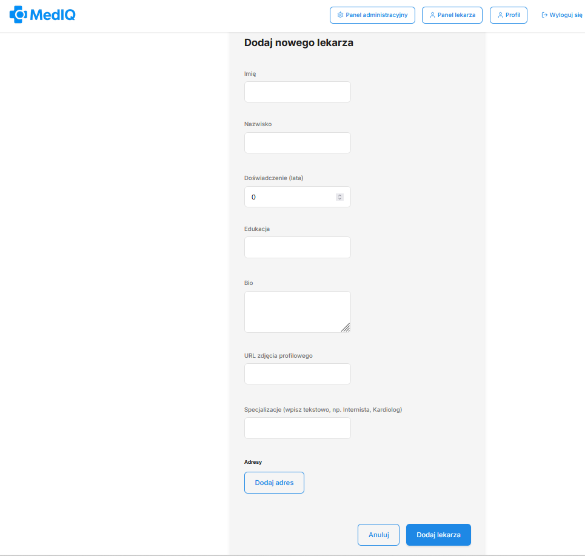

# MedIQ - Inteligentna Platforma Łącząca Pacjentów z Lekarzami

<div align="center">
  
  
  [](https://github.com/anthcode/mediq/actions/workflows/deploy.yml)
  [](https://opensource.org/licenses/MIT)
  
  **[Demo na żywo](https://56168c6e.mediq.pages.dev/)**
</div>

## 📋 O projekcie

MedIQ to nowoczesna platforma internetowa wykorzystująca sztuczną inteligencję do analizy symptomów pacjentów i łączenia ich z odpowiednimi lekarzami specjalistami. Aplikacja eliminuje niepewność w wyborze specjalizacji medycznej poprzez inteligentną analizę opisanych objawów.

### 🎯 Główne funkcjonalności

- **🤖 Analiza AI symptomów** - wykorzystuje model Google Gemma 3 27B (przez OpenRouter API) do analizy objawów
- **🔍 Inteligentne wyszukiwanie lekarzy** - dopasowanie specjalistów na podstawie analizy AI
- **👤 System autentykacji** - pełny system rejestracji i logowania użytkowników
- **🏥 Panel administracyjny** - kompleksowy CRUD dla zarządzania lekarzami
- **📊 Historia wyszukiwań** - zapisywanie i przeglądanie historii zapytań użytkownika
- **📱 Responsywny design** - pełna optymalizacja dla urządzeń mobilnych
- **🔒 System ról i uprawnień** - różne poziomy dostępu (user, doctor, moderator, administrator)

## 🖼️ Screenshoty

### Strona główna


*Intuicyjny interfejs wyszukiwania z polem do opisu symptomów*

### Wyniki wyszukiwania z analizą AI


*Panel analizy AI pokazujący zidentyfikowane objawy i sugerowane specjalizacje wraz z listą dopasowanych lekarzy*

### Profil lekarza


*Kompletne informacje o lekarzu wraz z danymi kontaktowymi*

### Panel użytkownika


*Zarządzanie profilem i przeglądanie historii wyszukiwań*

### Panel administracyjny


*Kompleksowy system CRUD do zarządzania bazą lekarzy*

### Formularz dodawania/edycji lekarza


*Intuicyjny formularz z walidacją danych*

## 🚀 Technologie

### Frontend

- **React 18+** z TypeScript
- **Vite** - szybki bundler
- **Styled Components** - stylowanie komponentów
- **React Router v6** - routing
- **React Context API** - zarządzanie stanem
- **Lucide React** - ikony

### Backend

- **Supabase** - kompleksowe rozwiązanie backendowe
  - PostgreSQL - baza danych
  - Autentykacja użytkowników
  - Row Level Security (RLS)
  - Storage dla plików

### AI & Integracje

- **OpenRouter API** - dostęp do modelu AI
- **Google Gemma 3 27B** - model językowy do analizy symptomów

### DevOps & Testy

- **GitHub Actions** - CI/CD pipeline
- **Cloudflare Pages** - hosting
- **Jest & React Testing Library** - testy jednostkowe
- **Cypress** - testy E2E
- **ESLint & Prettier** - jakość kodu

## 📁 Struktura projektu

```
mediq/
├── .github/
│   └── workflows/           # GitHub Actions workflows
├── cypress/                 # Testy E2E
│   ├── e2e/
│   ├── fixtures/
│   └── support/
├── public/                  # Zasoby statyczne
├── src/
│   ├── __tests__/          # Testy jednostkowe
│   ├── components/         # Komponenty React
│   │   ├── admin/         # Komponenty panelu admina
│   │   ├── common/        # Wspólne komponenty UI
│   │   ├── doctors/       # Komponenty lekarzy
│   │   ├── layout/        # Komponenty układu
│   │   ├── profile/       # Komponenty profilu
│   │   └── search/        # Komponenty wyszukiwania
│   ├── contexts/          # React Contexts
│   ├── hooks/             # Custom hooks
│   ├── lib/               # Integracje (Supabase, OpenAI)
│   ├── pages/             # Komponenty stron
│   ├── services/          # Serwisy biznesowe
│   ├── styles/            # Style globalne i theme
│   ├── types/             # Definicje TypeScript
│   └── utils/             # Funkcje pomocnicze
├── supabase/
│   └── migrations/        # Migracje bazy danych
└── [pliki konfiguracyjne]
```

## 🛠️ Instalacja i uruchomienie

### Wymagania

- Node.js 18+
- npm lub yarn
- Konto Supabase
- Klucz API OpenRouter

### Kroki instalacji

1. **Sklonuj repozytorium**

```bash
git clone https://github.com/anthcode/mediq.git
cd mediq
```

2. **Zainstaluj zależności**

```bash
npm install
```

3. **Skonfiguruj zmienne środowiskowe**

```bash
cp .env.example .env
```

Wypełnij plik `.env`:

```env
VITE_SUPABASE_URL=your_supabase_url
VITE_SUPABASE_ANON_KEY=your_supabase_anon_key
VITE_OPENROUTER_API_KEY=your_openrouter_api_key
```

4. **Uruchom migracje Supabase**

```bash
npx supabase db push
```

5. **Uruchom aplikację**

```bash
npm run dev
```

Aplikacja będzie dostępna pod adresem `http://localhost:5174`

## 🧪 Testowanie

### Testy jednostkowe

```bash
npm run test
```

### Testy E2E

```bash
npm run test:e2e
```

### Pokrycie kodu

```bash
npm run test:coverage
```

## 📦 Deployment

Aplikacja jest automatycznie deployowana na Cloudflare Pages przy każdym push do brancha `main` poprzez GitHub Actions.

### Ręczny build

```bash
npm run build
```

## 👥 Konta testowe

Dla osób oceniających projekt dostępne są specjalne konta testowe z różnymi poziomami uprawnień. Dane dostępowe zostaną przekazane bezpośrednio przez autora projektu.

## 🔒 Bezpieczeństwo

- Autentykacja oparta na JWT (Supabase Auth)
- Row Level Security (RLS) w PostgreSQL
- Walidacja danych po stronie klienta i serwera
- Bezpieczne przechowywanie kluczy API
- Ochrona przed XSS i CSRF

## 📈 Przyszłe funkcjonalności

- **💬 System komunikacji** - czat między pacjentami a lekarzami
- **📅 Rezerwacja wizyt** - kalendarz dostępności lekarzy
- **⭐ System ocen i opinii** - recenzje pacjentów
- **💳 Płatności online** - integracja z bramkami płatności
- **📱 Aplikacja mobilna** - natywne aplikacje iOS/Android
- **🌍 Wielojęzyczność** - wsparcie dla wielu języków
- **📊 Panel analityczny** - statystyki dla lekarzy
- **🔔 Powiadomienia** - przypomnienia o wizytach
- **📄 Dokumentacja medyczna** - przechowywanie historii medycznej
- **🏥 Integracja z NFZ** - weryfikacja uprawnień

## 🤝 Autorzy

Projekt stworzony jako praca zaliczeniowa w ramach kursu programowania 10xdevs.

## 📄 Licencja

Ten projekt jest licencjonowany na podstawie licencji MIT - zobacz plik [LICENSE](LICENSE) dla szczegółów.
